<h1 align="center">Rudy Ong</h1>

  Student and researcher in Japan, working on multimodal machine learning — 
  audio-visual speech recognition and lip reading.

  <a href="https://rudy-ong.github.io"><strong>Interactive lab →</strong></a>
  ·
  <a href="https://www.linkedin.com/in/rudyong/">LinkedIn</a>
  ·
  <a href="mailto:rudy.ong.95@gmail.com">Email</a>

---

### 🫦 Try the lip-reading toy

A mouth silently articulates a Japanese word. Can you tell which one it said?

That is exactly the task an audio-visual speech recognition model faces when the audio
channel is unusable — and it is much harder than it sounds. The
**[interactive lab](https://rudy-ong.github.io)** lets you try it yourself, explore how
each vowel reshapes the mouth, and watch an audio-only model fall apart under noise while
the visual stream holds steady.

<!-- Once the site is live, consider dropping a short screen-recording GIF here. -->

---

### 🛠 Building

**[Flash_Card_App](https://github.com/Rudy-Ong/Flash_Card_App)** · JavaScript
A spaced-repetition flashcard app — the practical counterpart to the language-learning
side of my research interests.

<!-- Add new projects here. One line on what it does, one on why it exists. -->

---

### 🔬 Researching

**[usr2_avsr_lip_reading](https://github.com/Rudy-Ong/usr2_avsr_lip_reading)** · Python
Built on [ahaliassos/usr2](https://github.com/ahaliassos/usr2). I am comparing three input
conditions on the same downstream ASR task:

| Input | What the model gets | Where it wins |
|---|---|---|
| **Audio only** | Waveform, no video | Clean conditions, low latency |
| **Video only** | Lips moving, no sound | Loud rooms, privacy, damaged audio |
| **Audio-visual** | Both, fused | Degraded audio — the visual stream fills the gaps |

The question that interests me is not which one is best overall, but *where the crossover
sits*: how much noise the audio channel has to take before watching the mouth becomes the
better bet.

---

### 🐍 しりとり — the contribution graph, as a word chain

The snake below eats my contribution squares. Each square it swallows releases a kana, and
those kana spell a **shiritori** chain — the Japanese word game where every word must begin
with the kana the last one ended on: さくら → らくご → ごい.

A snake is a chain; shiritori is a chain. It seemed rude not to.

<picture>
  <source media="(prefers-color-scheme: dark)" srcset="dist/shiritori-snake-dark.svg">
  
</picture>

Words ending in ん never appear — playing one loses the game.

---

### 📊 By the numbers

<picture>
  <source media="(prefers-color-scheme: dark)" srcset="dist/stats-dark.svg">
  
</picture>
<picture>
  <source media="(prefers-color-scheme: dark)" srcset="dist/langs-dark.svg">
  
</picture>

 

---

<strong>How this README builds itself</strong>

 

Everything above is generated, committed, and refreshed daily by
[a GitHub Action](.github/workflows/build-profile.yml). Three things made it more
interesting to build than expected:

**GitHub blocks webfonts inside README images.** Kana in an SVG `<text>` element fall back
to whatever the viewer happens to have installed — usually tofu boxes. So every glyph is
pre-converted to a `<path>` outline at build time and committed as
[`data/kana-paths.json`](data/kana-paths.json). The daily build needs no font at all.

**`prefers-reduced-motion` does not reach inside an ``.** When Chrome renders an SVG
loaded as an image, the media query evaluates as `no-preference` regardless of the viewer's
real setting. So the animation runs by default and is switched *off* under `reduce`, never
the other way around — gating it behind `no-preference` would risk it never running at all.

**No pathfinding.** The snake follows a fixed boustrophedon sweep rather than solving for a
route. It is always valid, needs no solver, and reads as deliberate.

The shiritori chain is not hand-ordered either.
[`data/shiritori-words.json`](data/shiritori-words.json) is an unordered pool; a solver
searches it for a long valid chain and asserts the rules at build time, so adding a word can
never quietly break the chain.

The stats cards are generated here too, rather than pulled from `github-readme-stats` —
its public instance is rate-limited, and self-hosting means a service to keep alive. The
whole daily build has zero npm dependencies.

<strong>Toolbox</strong>

 

**Research** · PyTorch · multimodal fusion · ASR / AVSR · lip reading

**Building** · Python · JavaScript · Node · Git / GitHub Actions

<!-- Trim or extend this to what you actually reach for. -->

Kana outlines from <a href="https://fonts.google.com/specimen/M+PLUS+1p">M PLUS 1p</a> (SIL OFL 1.1) — see <a href="assets/OFL.txt">assets/OFL.txt</a>.
