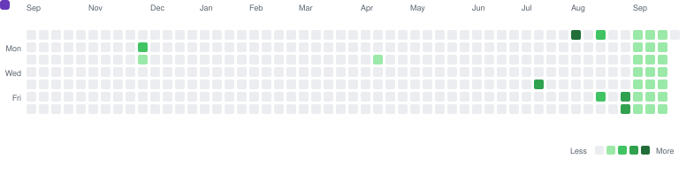
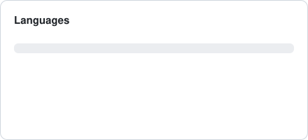

<h1 align="center">Rudy Ong</h1>

  Student and researcher in Japan, working on Japanese speech processing — 
  phone-level ASR, vowel devoicing, and computer-assisted pronunciation training.

  <a href="https://huggingface.co/spaces/Rudy-Ong/ja_vowel_devoicing_detection"><strong>Try the devoicing detector →</strong></a>
  ·
  <a href="https://huggingface.co/Rudy-Ong">Hugging Face</a>
  ·
  <a href="https://www.linkedin.com/in/rudyong/">LinkedIn</a>
  ·
  <a href="mailto:rudy.ong.95@gmail.com">Email</a>

---

### 🔊 Vowel devoicing, detected from audio

Japanese high vowels have a habit of going quiet. In 好き *suki* the /u/ sits between two
voiceless consonants and loses its voicing; in です *desu* the final /u/ does the same.
Native speakers do this without noticing. Learners often don't do it at all — and a
recogniser has to account for a vowel that left almost no acoustic trace behind.

**[Japanese Phone ASR — Vowel Devoicing](https://huggingface.co/spaces/Rudy-Ong/ja_vowel_devoicing_detection)**
takes audio and marks, phone by phone, where devoicing actually occurred.

| Context | Example | Typically |
|---|---|---|
| /i/ or /u/ between two voiceless consonants | 好き *suki*, した *shita* | devoiced |
| High vowel word-final after a voiceless consonant | です *desu*, ます *masu* | devoiced |
| Vowel carrying the pitch accent | varies | more likely to keep voicing |
| Kansai and western dialects | — | devoice far less than Tokyo speech |

Devoicing is *mostly* predictable from context and then isn't: it shifts with speaker,
dialect, speech rate and accent placement. So rather than applying rules after the fact, the
model marks it during recognition — devoiced high vowels are upper-cased in the transcript
(`s U k i`), which makes transcription and devoicing detection a single pass instead of two.

---

### 🛠 Building

**[Flash_Card_App](https://github.com/Rudy-Ong/Flash_Card_App)** · JavaScript
A spaced-repetition flashcard app — the practical counterpart to the language-learning
side of my research interests.

<!-- Add new projects here. One line on what it does, one on why it exists. -->

---

### 🔬 Researching

**[ASR_JA_Vowel_Devoicing](https://github.com/Rudy-Ong/ASR_JA_Vowel_Devoicing)** · Python
Conformer encoder / Transformer decoder seq2seq, trained on JSUT basic5000 with
`phone_level3` transcripts. Training, inference, evaluation and a Gradio demo.

The best configuration reaches **2.65% PER** with **92.6% devoicing F1** on the held-out
split. The result I find most interesting is the trade-off: weighting the devoicing loss
more heavily pushes recall to 95.0% and detection accuracy to 96.2%, but costs both
precision and overall phone error rate. Catching every devoiced vowel and transcribing
cleanly pull in opposite directions.
[Full results table →](https://github.com/Rudy-Ong/ASR_JA_Vowel_Devoicing/blob/main/results.md)

**[ja_devoicing_vowel_phone3_r3](https://huggingface.co/Rudy-Ong/ja_devoicing_vowel_phone3_r3)**
· the trained checkpoint, running live in
[the Space](https://huggingface.co/spaces/Rudy-Ong/ja_vowel_devoicing_detection).

The pronunciation-training angle follows from the same question — you cannot give a learner
feedback on devoicing you cannot reliably detect.

<!-- survey_ja_museika is left out on purpose: that Space is currently paused, so the
     link would land visitors on "This Space has been paused". Restart it and add:
     **[survey_ja_museika](https://huggingface.co/spaces/Rudy-Ong/survey_ja_museika)**
     · <one line on what it actually does — I did not want to guess from the name>. -->

<!-- Add papers, datasets or writeups here as they land. -->

---

### 🐍 しりとり — the contribution graph, as a word chain

The snake below eats my contribution squares. Each square it swallows releases a kana, and
those kana spell a **shiritori** chain — the Japanese word game where every word must begin
with the kana the last one ended on: さくら → らくご → ごい.

A snake is a chain; shiritori is a chain. It seemed rude not to.

<picture>
  <source media="(prefers-color-scheme: dark)" srcset="dist/shiritori-snake-dark.svg">
  
</picture>

Words ending in ん never appear — playing one loses the game.

---

### 📊 By the numbers

<picture>
  <source media="(prefers-color-scheme: dark)" srcset="dist/stats-dark.svg">
  
</picture>
<picture>
  <source media="(prefers-color-scheme: dark)" srcset="dist/langs-dark.svg">
  
</picture>

 

---

<strong>How this README builds itself</strong>

 

Everything above is generated, committed, and refreshed daily by
[a GitHub Action](.github/workflows/build-profile.yml). Three things made it more
interesting to build than expected:

**GitHub blocks webfonts inside README images.** Kana in an SVG `<text>` element fall back
to whatever the viewer happens to have installed — usually tofu boxes. So every glyph is
pre-converted to a `<path>` outline at build time and committed as
[`data/kana-paths.json`](data/kana-paths.json). The daily build needs no font at all.

**`prefers-reduced-motion` does not reach inside an ``.** When Chrome renders an SVG
loaded as an image, the media query evaluates as `no-preference` regardless of the viewer's
real setting. So the animation runs by default and is switched *off* under `reduce`, never
the other way around — gating it behind `no-preference` would risk it never running at all.

**No pathfinding.** The snake follows a fixed boustrophedon sweep rather than solving for a
route. It is always valid, needs no solver, and reads as deliberate.

The shiritori chain is not hand-ordered either.
[`data/shiritori-words.json`](data/shiritori-words.json) is an unordered pool; a solver
searches it for a long valid chain and asserts the rules at build time, so adding a word can
never quietly break the chain.

The stats cards are generated here too, rather than pulled from `github-readme-stats` —
its public instance is rate-limited, and self-hosting means a service to keep alive. The
whole daily build has zero npm dependencies.

<strong>Toolbox</strong>

 

**Research** · PyTorch · ASR · Japanese phonetics · phone-level modelling · CAPT

**Building** · Python · JavaScript · Node · Gradio · Git / GitHub Actions

<!-- Trim or extend this to what you actually reach for. -->

Kana outlines from <a href="https://fonts.google.com/specimen/M+PLUS+1p">M PLUS 1p</a> (SIL OFL 1.1) — see <a href="assets/OFL.txt">assets/OFL.txt</a>.
